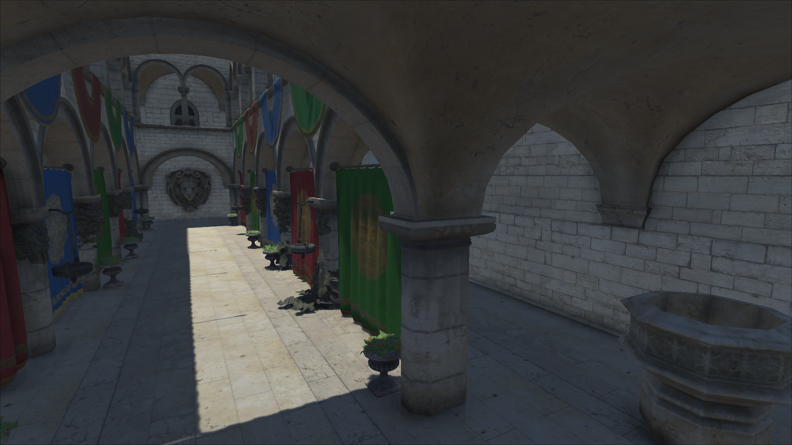
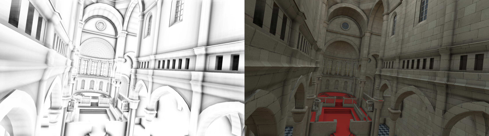

Alchemy Ambient Obscurance for Unity 3D
------------

This is a lightweight script & shader that implements the Alchemy Ambient Obscurance for Unity 3D, with some added techniques from HBAO+ and Separable AO.

Deferred shading path & HDR is required. 

Simply attach the script to the main camera of the scene.

On my 940MX, the rendering of these two images took less than 8ms, at 1080p.

References:

[Alchemy AO](https://research.nvidia.com/publication/alchemy-screen-space-ambient-obscurance-algorithm)

[Deinterleaving Depth Buffer](https://developer.nvidia.com/sites/default/files/akamai/gamedev/docs/BAVOIL_ParticleShadowsAndCacheEfficientPost.pdf)

[Two-pass Separable Appoarch](https://perso.telecom-paristech.fr/boubek/papers/SAO/)